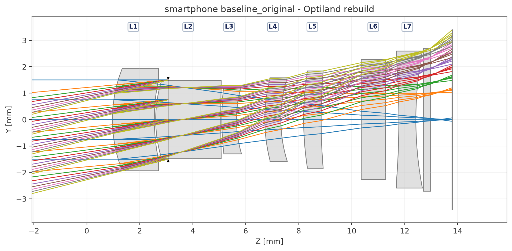
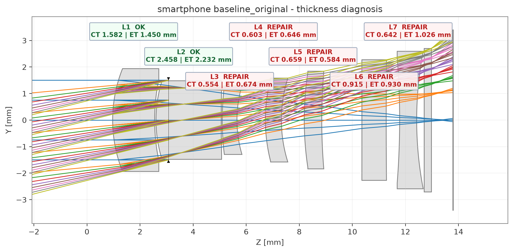
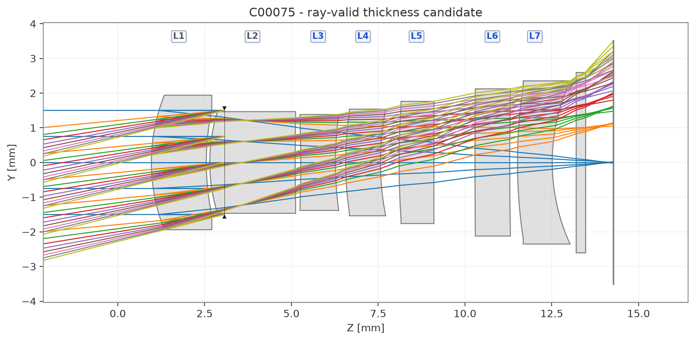

# CODE V / Optiland Thickness Repair Tool

A lightweight companion tool for generating **multiple thickness-feasible starting structures** from a CODE V `.seq` file.

The script is intended for situations where an optical design already has a useful first-order structure, but one or more lenses are too thin for practical manufacturing. Instead of forcing a single structure back into the feasible region through repeated constrained optimization, the tool generates a population of alternative, power-preserving candidate structures for subsequent optimization in CODE V or Optiland.

## Example Workflow

The example below is a 7-lens smartphone-camera starting structure. Its EFL and overall layout are already close to the design target, but several lenses are thinner than the selected manufacturing limit.

### 1. Original CODE V structure rebuilt in Optiland



### 2. Automatic thickness diagnosis

The diagnostic step identifies physical lenses by `L1`, `L2`, `L3`, etc., reports their center thickness (CT) and edge thickness (ET), and marks lenses that violate the requested constraints.



In this example, L3-L7 are identified for repair.

### 3. One generated ray-valid candidate

The generator repairs the selected lens thicknesses while sampling alternative lens bendings. Structurally valid candidates are then checked with multi-field real-ray tracing.



The script exports **all ray-valid candidates** rather than ranking them. The designer can inspect the generated layouts and select one or more promising structures for subsequent optimization.

---

## Purpose

`thickness_repair.py` creates thickness-repaired lens candidates from a CODE V `.seq` file. It:

- reads the CODE V prescription;
- rebuilds the system in Optiland;
- diagnoses lens-thickness violations;
- allows the user to select which physical lenses should be repaired;
- generates multiple power-preserving thickness-repaired structures;
- checks structural constraints;
- performs multi-field real-ray validation;
- exports new CODE V `.seq` files and lens-layout images.

The input `.seq` file is read only and is never overwritten.

The original EFL is measured automatically and is not entered by the user.

Each normal run uses a non-deterministic NumPy random generator, so repeating the same constraints and lens selection can produce a different set of valid candidate structures.

## Core Idea

For each repaired lens, the script changes the center thickness while preserving the lens's original **paraxial optical power**.

Changing the thickness and bending of a thick lens generally moves its principal planes. The tool does **not** force the individual principal planes to remain at their original physical positions.

Instead, it compensates the principal-plane shifts by adjusting the adjacent physical air spaces so that the effective spacing between neighboring powered elements is preserved as closely as possible.

Conceptually:

```text
Original lens power
        +
New center thickness
        +
Alternative power-preserving bending
        ↓
Principal-plane shift
        ↓
Adjacent air-gap compensation
        ↓
Approximately preserved first-order skeleton
```

Mechanical feasibility still has priority at repair boundaries. If a leading or trailing air gap violates the requested minimum spacing or causes physical overlap, the script applies the minimum required spacing correction and then rechecks EFL, total length, and ray validity.

The generator deliberately does **not** optimize RMS, MTF, distortion, or other image-quality metrics. Its job is to generate feasible and structurally diverse starting points. Image-quality optimization is left to the designer and the downstream optical optimizer.

## Recommended Scope

This tool is intended mainly for:

- Initial optical structures rather than fully finished production designs.
- Centered sequential systems.
- Systems using spherical lens surfaces.
- Designs with sufficient air-gap and total-length margin.
- Moderate center-thickness corrections where the initial and target thicknesses are reasonably close.

## Running in VS Code

1. Open the folder containing `thickness_repair.py` in VS Code.
2. Open `thickness_repair.py`.
3. Select a Python interpreter in which Optiland and the required dependencies are installed.
4. Click **Run Python File in Terminal**.
5. At the first prompt, enter the full path of the CODE V `.seq` file to repair.  
   This input is required; the program does not contain a default file path.
6. Enter the four requested constraints:
   - Minimum glass center thickness
   - Minimum glass edge thickness
   - Minimum center air gap
   - Maximum total thickness

   All four values are required. The program does not contain default constraint values.

7. Select the physical lenses to repair. Examples:

   ```text
   L3 L4 L5
   L3-L7
   ```

   Press **Enter** to repair every CT/ET-noncompliant lens. Enter `NONE` to cancel.

8. Enter a brand-new output-folder path, or press **Enter** to create an automatic timestamped folder. An existing output path will not be overwritten.

## Command-Line Example

Run the following from the script folder in a PowerShell terminal.

The numbers below are example user inputs only; they are not program defaults.

```powershell
python .\thickness_repair.py `
  "C:\path\to\input.seq" `
  --ct-min 1.0 --et-min 0.2 `
  --center-gap-min 0.1 --ttl-max 13.5 `
  --lenses L3-L7 `
  --output-dir "C:\path\to\new_output" `
  --non-interactive
```

The command may also be entered on one line.

## Output Files

A normal output folder contains:

- Ray-valid candidate `.seq` files
- A physical-lens layout for every candidate
- Input and thickness-diagnosis layouts
- `diagnosis.txt`
- `candidate_summary.csv`
- `generation_report.txt`

Example outputs are included in the repository under `generated_structures/`.

## Design Philosophy

The tool intentionally separates three tasks:

```text
Diagnosis → Generation → Selection / Optimization
```

**Diagnosis** identifies structural problems.

**Generation** creates multiple physically feasible candidate structures without trying to decide which one has the best image quality.

**Selection and optimization** are left to the designer or to a downstream optimizer such as CODE V.

This separation is intentional. A candidate does not need to be the final optical design; it only needs to provide a useful, feasible starting point with enough structural freedom for later optimization.

## Limitations and Possible Failure Cases

The search may fail to produce a valid candidate when the requested constraints are too severe for the initial structure. Typical examples include:

- A maximum total thickness that is too short.
- Lenses or components that are already tightly crowded.
- Insufficient air-gap or edge-clearance margin.
- A very large difference between the initial lens thickness and the requested target thickness.
- A combination of thickness, spacing, EFL, and ray-trace requirements that has no feasible solution within the preserved search method.
- Unsupported or strongly non-spherical geometry.

### Aspheric surfaces

The current workflow is primarily intended for spherical prescriptions.

If the input `.seq` contains Qcon or other aspheric coefficients, the program issues a warning. CODE V Qcon surfaces are not assumed to be reproduced exactly in Optiland.

### Field coverage

If the input prescription contains only an on-axis field, the program issues a warning because the final real-ray validation cannot represent full-field feasibility.

## Important Note

A failed generation run does **not** mean that the optical design itself is impossible. It only means that no valid candidate was found by this repair method under the selected constraints.

Likewise, a generated candidate is not automatically a good final optical design.

Always inspect exported candidates in CODE V and perform the required image-quality, tolerance, and manufacturability checks before using a result in a final design.

## Case Study

A complete smartphone-camera example, including the conventional constrained-optimization workflow and a comparison with the thickness-repair workflow, is available in the repository's `case_study/` folder.

## License

This project is released under the MIT License.
